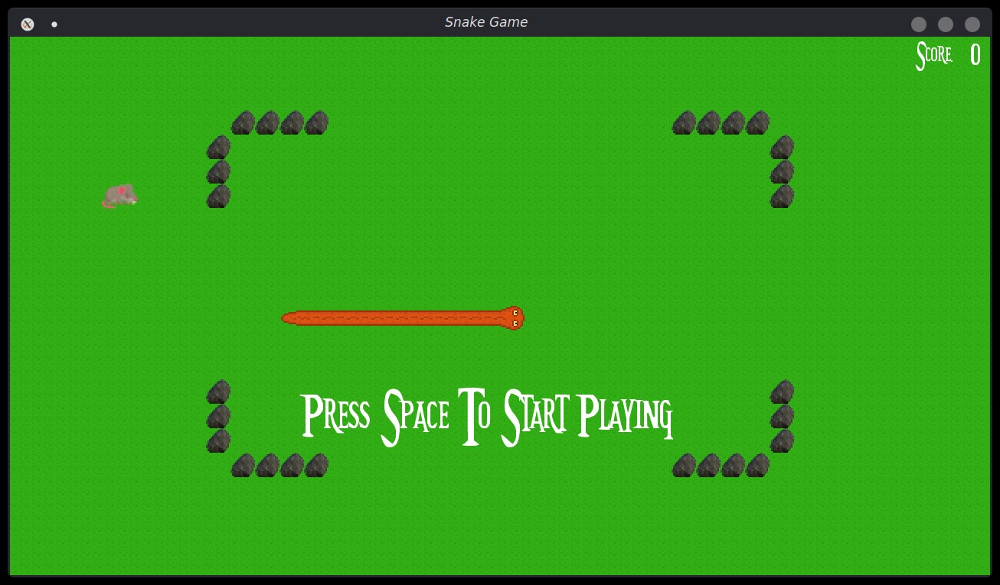
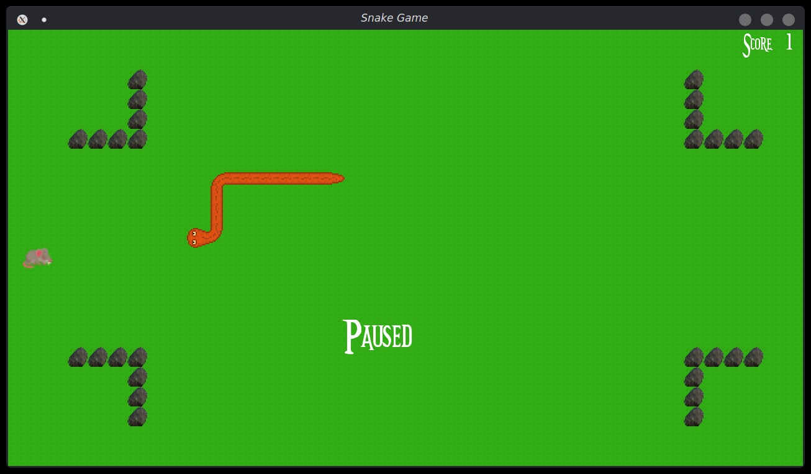
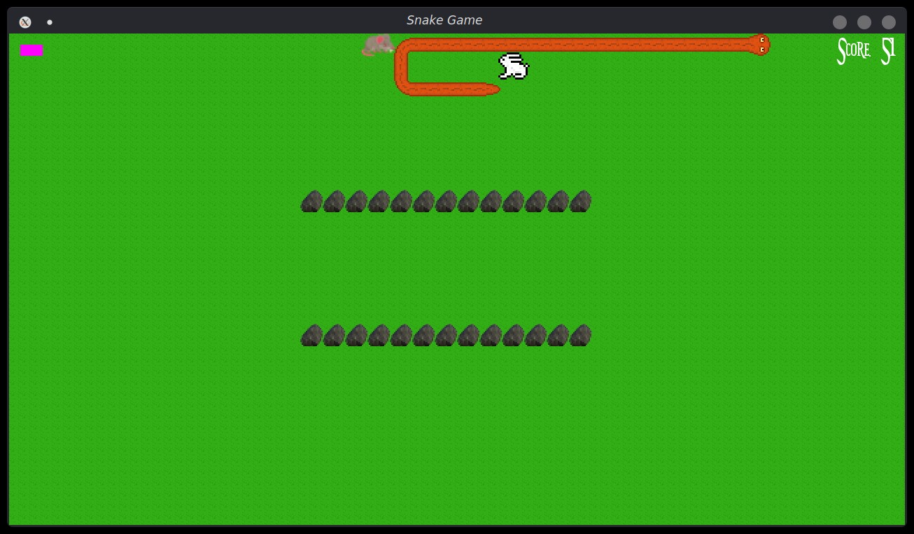
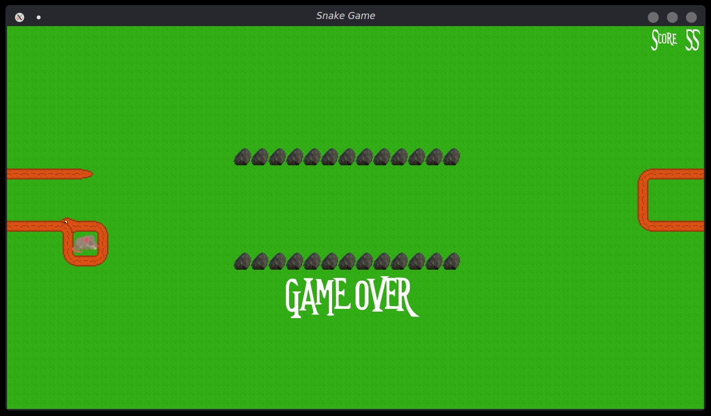

# Snake_Game
Simple snake game written in cpp

### How to build
#### Requirements:
  - c++ compiler (g++)
  - cmake
  - cmake generator (Gnu Makefile / ninja/ ...)

#### Instructions:
```bash
# clone repo:

git clone https://github.com/shadmansaleh/Snake_Game

# generate build scripts with cmake

cmake -B build/ -S ./

# Run generated build scripts. Assuming you're using gnu makefile

make  -C build

# Run the game windows

build\shake.exe

# Run the game linux/mac

build/snake
```

### ScreenShots





